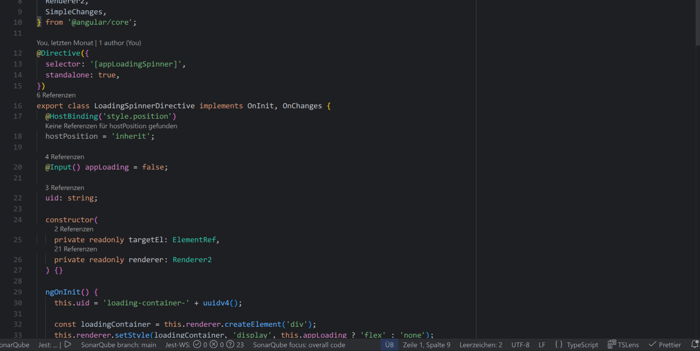
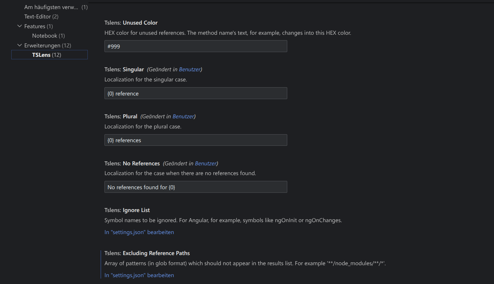

# TSLens - CodeLens for TypeScript and JavaScript

TSLens provides a way to see usages of methods, classes, properties etc. within TypeScript and JavaScript files in Codium / VSCode.

## Features

- TypeScript and JavaScript language support
- Support for Angular's Pipe search
- Patterns for exclusion to see references you're actually interested in
- Checking for usages of methods on first sight or non usage in code
- Options to modify the appearance such as localization of the reference presentation
- Easy toggling to show only if wanted including progress indicator

## Showcase

#### Editor view

<div style="text-align: center;">

</div>

#### Brief look of settings

<div style="text-align: center;">

</div>

## How does it work

Underlying the analyzation and handling is performed by the `CodeLensProvider` which

<ol>
  <li>checks the current <code>Document</code> (file) for symbols to check which could have different kinds 
  (e.g.<code>Method</code>, <code>Class</code>, <code>Property</code>) and then</li>
  <li>providing a list of locations for the individual symbols for calculating the references as counts or non-usage in the codebae.</li>
</ol>

TSLens injects some sugar in those steps by using a filter for TS and JS and giving the user some feedback like whether the reference has been used (or how often) and see those references in the editor directly.

The code is documented so take a look on it :)

### Build and test it yourself

For development NPM is used. Run the command

```bash
npm run vsce
```

to create a `.vsix` file which can be then loaded in Codium / VSCodium under the extensions menu. For local testing / development just use the watch feature (F5) to start the debugger mode.

## Additional notes

The base idea comes from kisstkondoros' [GitHub project Typelens](https://github.com/kisstkondoros/typelens.git) with optimization and additional features regarding logic and behavior, development environment and provided settings.
